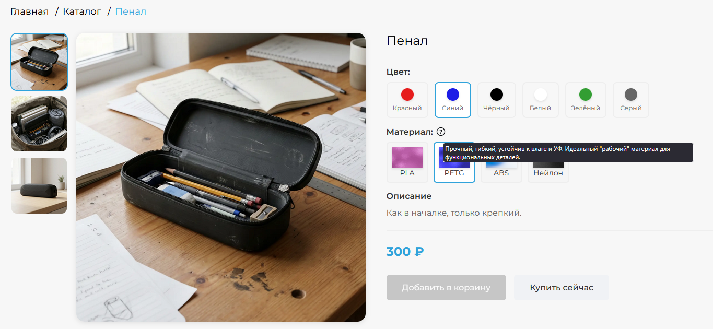
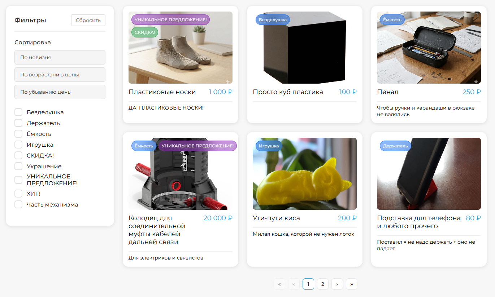
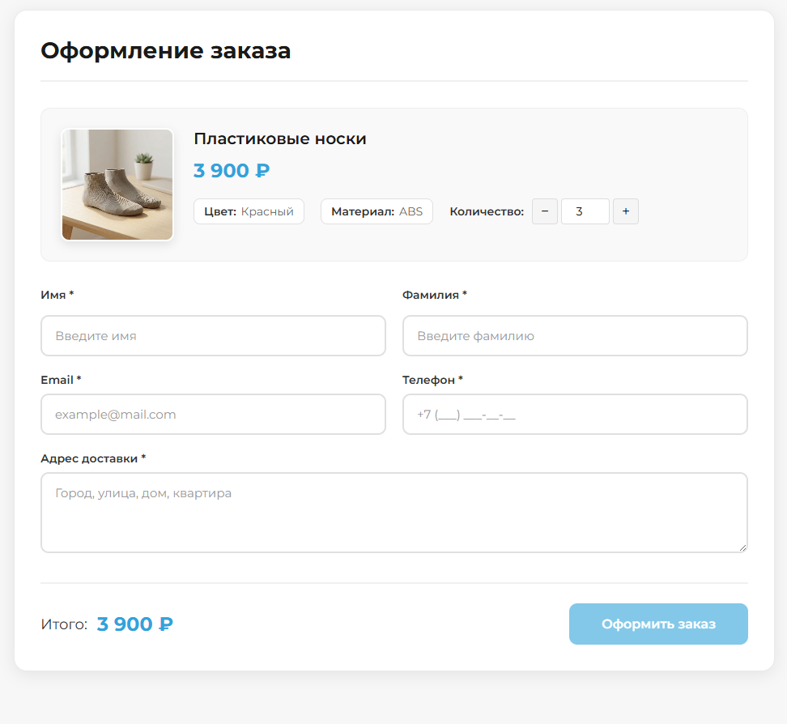
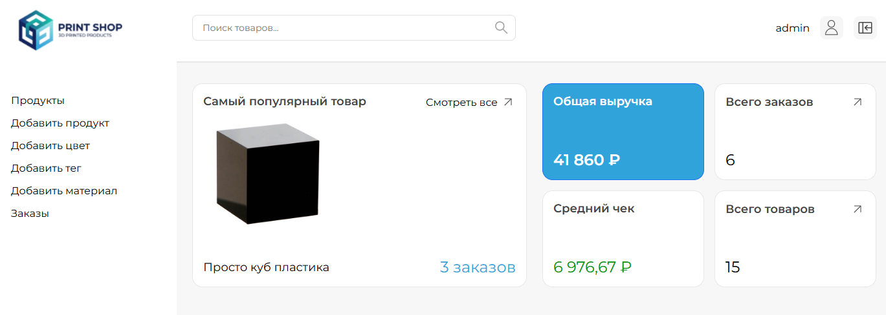
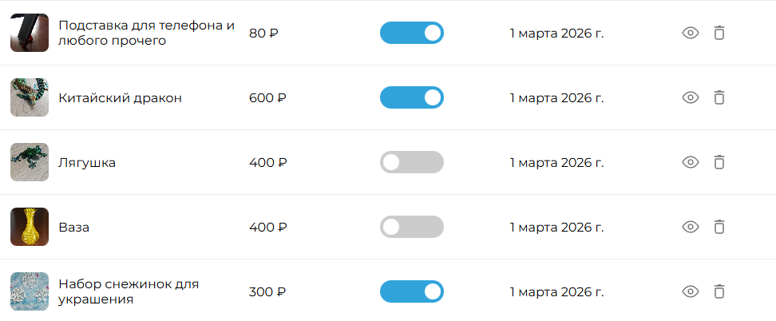
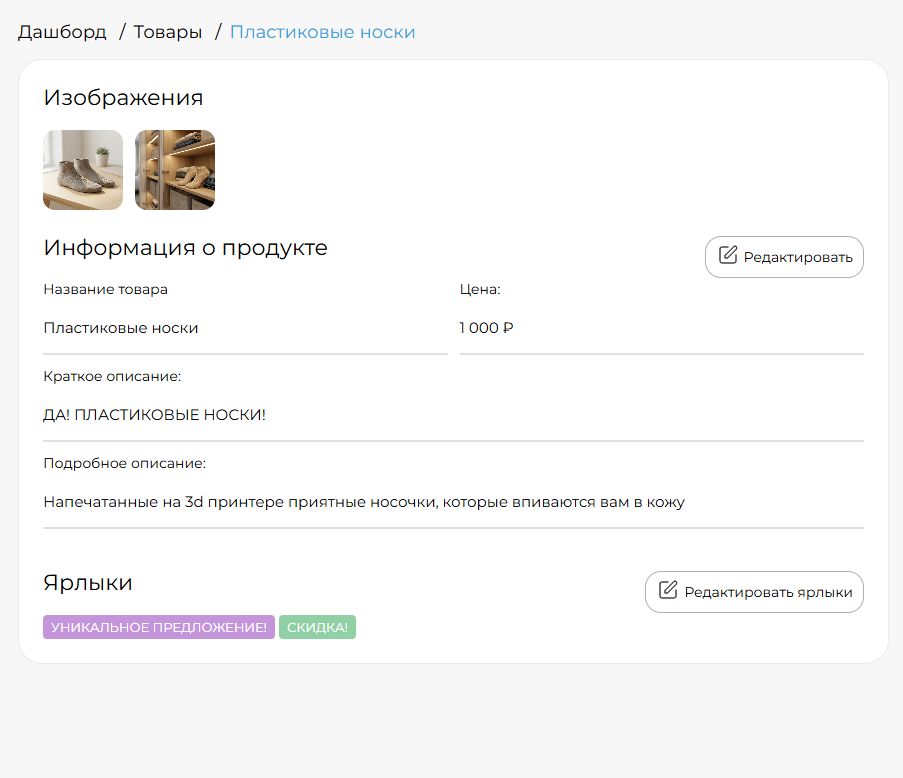

# Online Store Frontend

Frontend часть командного проекта интернет-магазина (выделенный репозиторий).

Проект предназначен для демонстрации frontend-части. Бэкенд в репозиторий не включен.

## О проекте

Интернет-магазин с клиентской частью и административной панелью.

## Архитектура

SPA-приложение с разделением на публичный и административный контуры.

- клиентская часть (каталог, товар, оформление заказа)
- административная панель (управление товарами и заказами)

Приложение использует роутинг и глобальное состояние для управления логикой интерфейса.

## Стек технологий

- Vue 3 (Options API)
- Pinia (state management)
- Vue Router (routing)
- Vite (build tool)
- REST API
- Docker, Apache

## Основной функционал

### API и роутинг

- Интеграция фронтенда с бэкендом через REST API
- Настройка маршрутизации приложения
- Организация навигации между страницами

### Каталог товаров

- Вывод списка товаров
- Пагинация
- Сортировка товаров
- Фильтрация каталога

### Пользователи

- Детальная страница товара
- Оформление заказа
- Пользовательские сценарии взаимодействия с магазином

### Административная панель

- Авторизация администратора
- Просмотр списка товаров
- Создание товаров
- Редактирование товаров
- Скрытие товаров
- Удаление товаров
- Просмотр списка заказов
- Удаление заказов

### Обработка ошибок

- Обработка HTTP-ошибок
- Отображение понятных сообщений пользователю
- Защита от некорректного ввода данных

## Скриншоты

### Карточка товара

### Каталог товаров

### Оформление заказа

### Административная панель

## Важно

В репозиторий намеренно не включены:

- PHP-бэкенд
- База данных
- Конфигурация серверной части
- Код других участников команды (бэкенд)

Проект опубликован исключительно для демонстрации навыков фронтенд-разработки и не предназначен для полноценного локального запуска без серверной части.
